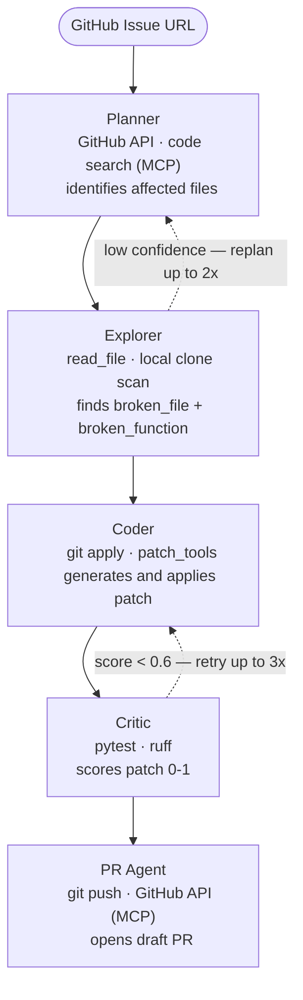

# Agentic Code Repair

Give it a GitHub issue URL. It reads the codebase, finds the broken code, writes a patch, runs the tests, and opens a draft PR — no human input beyond the issue.

Evaluated on [SWE-bench Lite](https://github.com/princeton-nlp/SWE-bench); 50 real bugs across Django, Sympy, scikit-learn, and 8 other OSS repos.

---

## Results

| Config | Model | Approved | Avg Score |
|--------|-------|----------|-----------|
| A — single-agent baseline | GPT-4o | 4% (2/50) | 0.21 |
| B — multi-agent pipeline | GPT-4o | 42% (21/50) | 0.46 |
| C — multi-agent (local) | Qwen2.5-Coder-32B | in progress | — |

Same 50 tasks across all configs. Config C runs on Bauhaus HPC via vLLM + SLURM.

---

## Demo

> Open a GitHub issue → pipeline fires automatically → draft PR appears


---

## How it works



### Scoring

The Critic scores every patch before deciding to approve, retry, or fail:

```
fix_score = 0.5 * test_pass_rate
          + 0.3 * no_regression        (rate, not binary)
          + 0.2 * code_quality
```

At historical `base_commit` checkpoints, package incompatibilities often cause pytest to collect 0 tests. In that case the formula switches to:

```
fix_score = 0.8 * llm_semantic_score
          + 0.2 * code_quality
```

Patches that reach 0.6 go through one more check — a separate LLM call that asks whether the patch actually addresses the root cause. If not, it retries.

---

## MCP Integration

The pipeline exposes itself as an **MCP server** and consumes a **local GitHub tools MCP server** — demonstrating both sides of the Model Context Protocol.

### As a server — callable from Claude Desktop

`src/mcp_server.py` exposes two tools:

| Tool | What it does |
|------|-------------|
| `fix_github_issue(url)` | Starts the pipeline in the background, returns a `job_id` immediately |
| `get_repair_status(job_id)` | Polls for the result — returns fix score, PR URL, patch preview |

The async job pattern avoids MCP client timeouts: the 5-agent pipeline runs in a background thread, the client polls until done.

**Claude Desktop config** (`%LOCALAPPDATA%\Packages\Claude_*\LocalCache\Roaming\Claude\claude_desktop_config.json`):

```json
{
  "mcpServers": {
    "agentic-code-repair": {
      "command": "/path/to/venv/Scripts/python.exe",
      "args": ["-m", "src.mcp_server"],
      "cwd": "/path/to/agentic-code-repair",
      "env": { "PYTHONPATH": "/path/to/agentic-code-repair" }
    }
  }
}
```

### As a client — consuming a GitHub tools MCP server

`src/github_mcp_server.py` is a local Python MCP server wrapping two GitHub API calls:

| Tool | Replaces |
|------|---------|
| `search_codebase` | Direct PyGithub `search_code` call |
| `create_pr` | Direct PyGithub `create_pull` call |

`src/tools/github_tools.py` consumes this server via `mcp.client.stdio.stdio_client` + `ClientSession`. In production, swap `github_mcp_server.py` for the [official GitHub MCP server](https://github.com/github/github-mcp-server) — no changes needed in the consumer.

`read_file` and `get_repo_structure` stay as direct PyGithub calls — they run 4–8 times per task in the Explorer's hot loop and need the in-process caching layer to avoid rate limits.

---

## Setup

Copy `.env.template` to `.env` and fill in:

```
GITHUB_WEBHOOK_SECRET=...
GITHUB_TOKEN=...
OPENAI_API_KEY=...
```

Install dependencies:

```bash
pip install -r requirements.txt
```

### Option A — GitHub webhook (autonomous)

```bash
uvicorn src.webhook:app --host 0.0.0.0 --port 8000
ngrok http 8000
```

Add the ngrok URL as a GitHub webhook — payload URL `https://<ngrok-id>.ngrok-free.app/webhook`, content type `application/json`, secret matching `GITHUB_WEBHOOK_SECRET`, events: Issues only.

Open a new issue and the pipeline runs in the background. Results go to `logs/webhook_results.jsonl`.

### Option B — Claude Desktop (MCP)

Register the server in the Claude Desktop config (see MCP section above), restart Claude Desktop, then in a new chat:

```
fix_github_issue("https://github.com/owner/repo/issues/123")
→ job_id: a3f9c2d1

get_repair_status("a3f9c2d1")
→ Status: APPROVED | Fix score: 0.74 | PR: https://github.com/...
```

### Option C — CLI

```bash
python main.py --issue-url https://github.com/owner/repo/issues/123
```

---

## Running evals

```bash
# multi-agent, 50 tasks
python run_eval.py --n 50 --working

# single-agent baseline
python run_eval.py --config a --n 50 --working

# specific tasks
python run_eval.py --tasks psf__requests-1734,psf__requests-1789
```

---

## Tech stack

| Layer | What |
|-------|------|
| Orchestration | LangGraph |
| LLM | GPT-4o / GPT-4o-mini / Qwen2.5-Coder-32B |
| Local inference | vLLM on SLURM (Bauhaus HPC) |
| MCP server | `mcp` Python SDK — pipeline + GitHub tools |
| MCP client | `mcp.client.stdio` — consuming GitHub tools server |
| GitHub | PyGithub (read_file, repo structure) |
| Observability | MLflow (metrics), Langfuse (LLM traces) |
| Web server | FastAPI + uvicorn |
| Linter | Ruff |
| Eval | SWE-bench Lite |

---

## Tests

```bash
pytest tests/ -v
```

14 tests: agent imports, critic scoring edge cases, tracing shim.

---

## Docs

- [structure.md](structure.md) — file layout
- [DECISIONS.md](DECISIONS.md) — why things are built the way they are
- [failure.md](failure.md) — what broke during eval and how it got fixed
